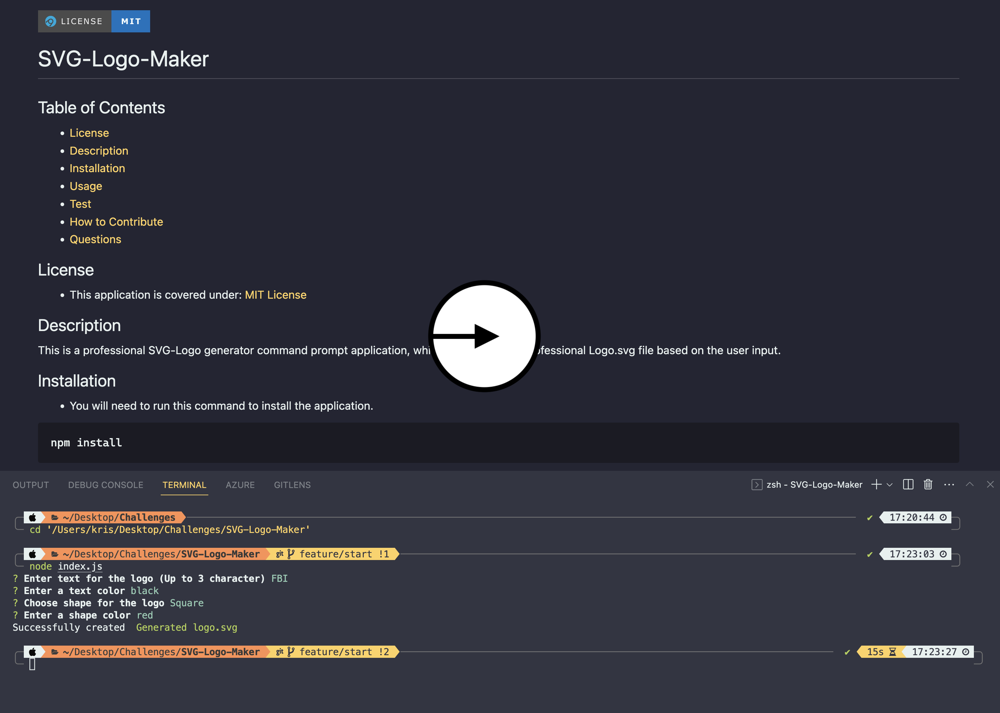

[](https://choosealicense.com/licenses/mit)     
# SVG-Logo-Maker
## Table of Contents
* [License](#license)
* [Description](#description)
* [Installation](#installation)
* [Usage](#usage)
* [Test](#test)
* [How to Contribute](#how-to-contribute)
* [Questions](#questions)
## License
 * This application is covered under: [MIT License](https://choosealicense.com/licenses/mit)
## Description
This is a professional SVG-Logo generator command prompt application, which will generate a professional Logo.svg file based on the user input.
## Installation
* You will need to run this command to install the application and dependencies.
```
npm install
```
* You will need to run this command to run the program.
```
node index.js
```
## Test
* You will need to run this command to test the program.
```
npm test
```

## Usage
In order to use the program you will need to clone the repository from GitHub provided in the link below.
## How to Contribute
For and suggestions or contributions you can reach me at my email address or you can clone to code and edit it the way it will suite you the best.

## Questions
* Reach me here on my GitHub account.
[kristiyantefov](https://github.com/kristefov) 
* Reach me on my email address for additional questions.
kristiyan.tefov@icloud.com
## Link
Link to repository:

https://github.com/kristefov/SVG-Logo-Maker

Link to Video Tutorial:
* click on the image to open the video tutorial

[](https://drive.google.com/file/d/1vMS3BybLl7ypFnMPQamm1ncDs6lsTyFO/view?usp=sharing)

